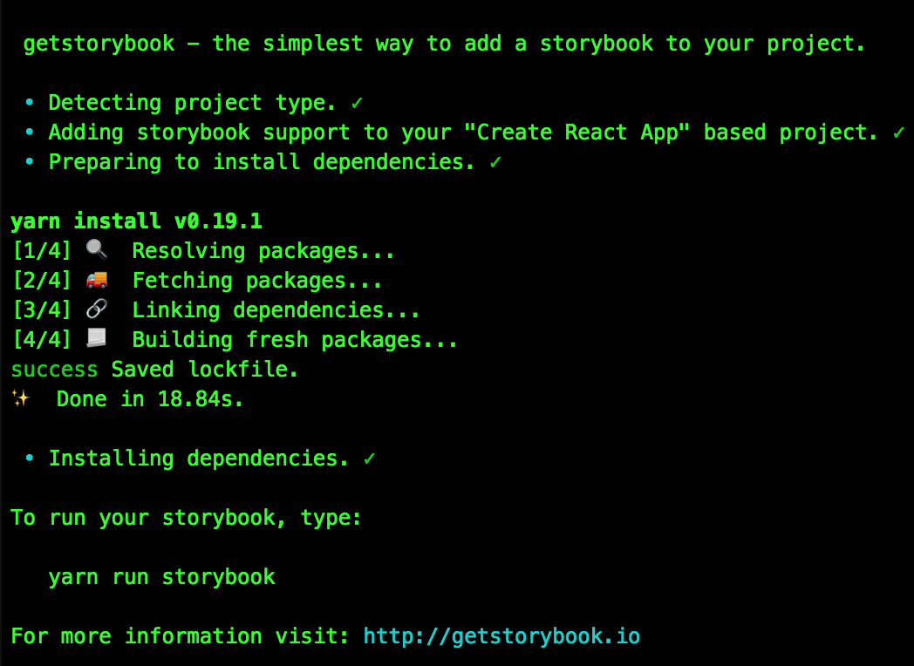
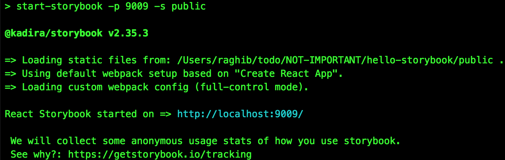
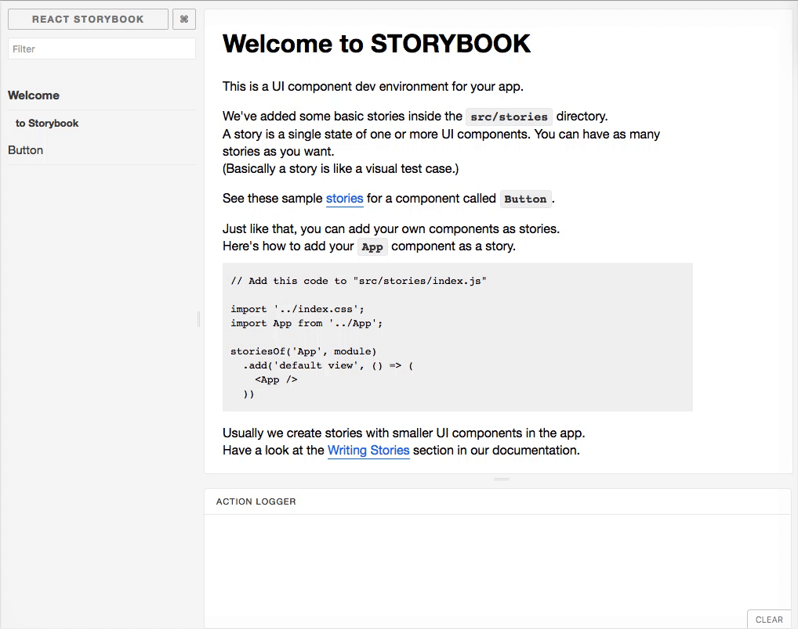
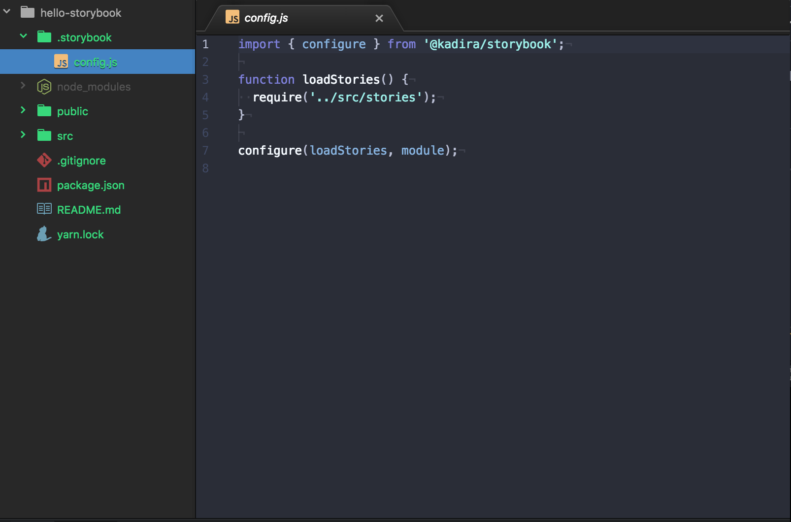
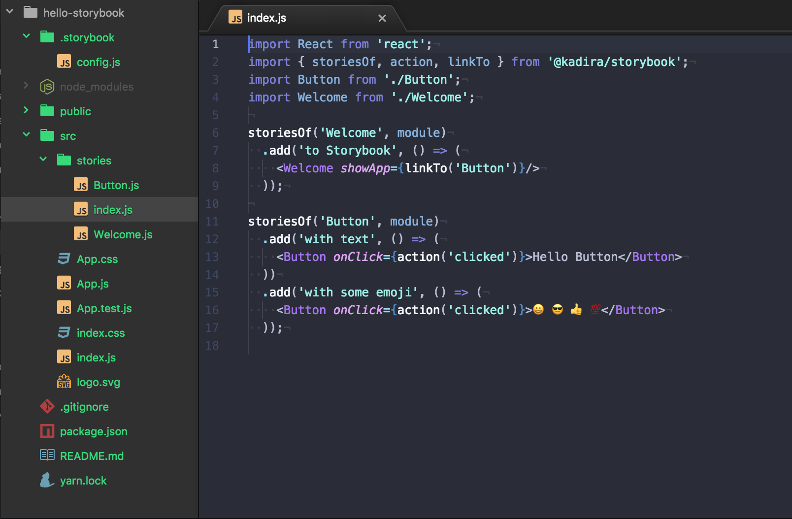
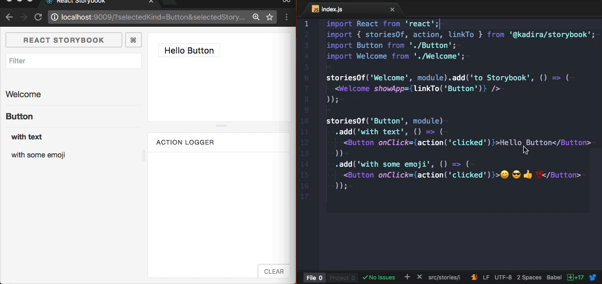
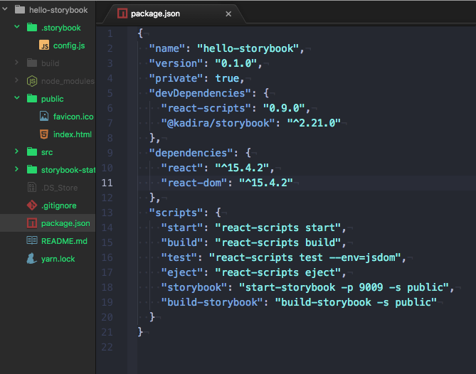

---

# React StoryBook 📖
> [React StoryBook](https://getstorybook.io/) is a UI component development environment for React. With that, you are able develop UI components without running your app 🙌

---

## 🔨 Step 1
```bash
$ create-react-app hello-storybook
```

## 🔨 Step 2
```bash
$ npm install -g getstorybook
```

## 🔨 Step 3
```bash
$ cd hello-storybook
$ getstorybook  # press enter
```


## 🔨 Step 4
```bash
$ npm run storybook
```


---

### 🚀  [http://localhost:9009](http://localhost:9009) in a 🌏 browser to 👀 the output



---

## The main configuration for storybook is 🔦 in `config.js`




## stories are 🔦 in `../src/stories`




---

## Lets try changing the button label 😄 🎉



## Awesome 😎, now lets try 🔧 changing the button component


---

## Wait ✋, it is possible deploy your `awesome storybook` into a `static site`

<br>

## Building 📖 storybook


```
$ npm run build-storybook

```
---

## Building react app

```
$ npm run build
```
---

## The build folder is ready to be deployed 🚀. You can serve it locally with a static server.

<br>

```
$ yarn global add pushstate-server

$ pushstate-server build

$ open http://localhost:9000
```
---


## REFERENCE

*   [STORY BOOK](https://getstorybook.io/)
*   [react](https://facebook.github.io/react/)
*   [create-react-app](https://github.com/facebookincubator/create-react-app)
