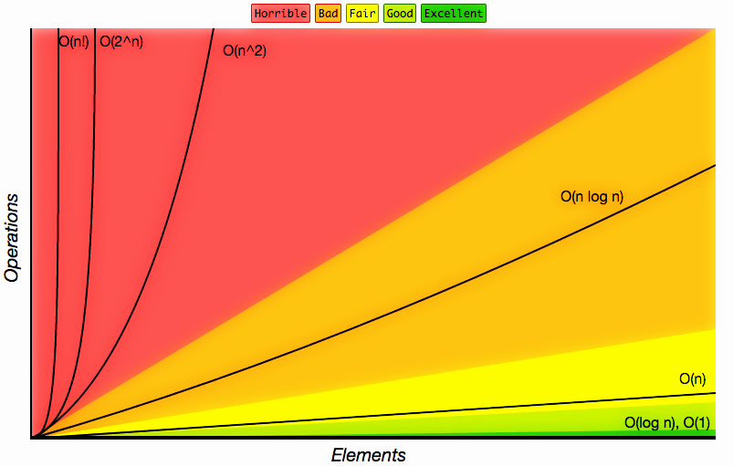

---

## What is `BIG-O NOTATION` ? 🤔
> Big-O Notation is a way of roughly meausing the performance of algorithms in order to compare one against another when discussing them.

<iframe width="550" height="300" src="https://www.youtube.com/embed/v4cd1O4zkGw" frameborder="0" allowfullscreen></iframe>

---

> Big-O Notation is a mathematical notation that we borrowed in computer science to classify by how they respond to the number (N) of items that you give them.

---
### There are ✌️ primary things that you 📏 measure with `BIG-O` :

---
1.  🕐 `Time complexity`- refers to the total count of operations an algorithm will perform given a set of items.

2.  🌌 `Space complexity`- refers to the total memory an algorithm will take up while running given a set of items.

---
> We measure these independently from one another because while an algorithm may perform less operations than another, it may also take up way more memory. Depending on what your requirements are, one may be a better choise than the other.

---
### Some Common `BIG-O's`:

| Name | Notation | Feeling at 🎉  |
|:----:|:--------:|:-------------: |
| Constant    | O(1)     | AWESOME! |
| Logarithmic | O(log N) | GREAT! |
| Linear      | O(N)     | OKAY. |
| Linearithmic | O(N log N) | UGH.. |
| Polynomial | O(N^2) | SHITTY |
| Exponential | O(2^N) | HORRIBLE |
| Factorial | O(N!) | WTF |
---
### Let's 👀 at what these would equal given (N) number of items.

| Notation | N = 5 | 10 | 20 | 30 |
|:-----------:|:---------:|:--------: |:-------------: |:---------: |
| O(1)        | 1         | 1         | 1              | 1         |
| O(log N)    | 2.3219... | 3.3219... | 4.3219...      | 4.9068... |
| O(N)        | 5         | 10        | 20             | 30        |
| O(N log N)  | 11.609... | 33.219... | 84.638...      | 147.204... |
| O(N ^ 2)    | 25        | 100       | 400            | 900       |
| O(2 ^ N)    | 32        | 1024      | 1,048,576      | 1,073,741,824 |
| O(N!)       | 120       | 3,628,800 | 2,432,902,0... | 265,252,859,812,... |
---
### From relatively small sets of data you can do a **lot** of extra work.
---

### With data structures, you can perform 4 primary types of actions:
 

1.  Accessing

2.  Searching

3.  Inserting

4.  Deleting

---

### It's important to **note** that `data structures` may be 👍 `good` at one action but 👎 `bad` at another.
 

| Data structures  | Accessing | Searching | Inserting  | Deleting |
|-----------------|--------------|------------ |------------|----------|
| Array  | O(1) | O(N) | O(N) | O(N) |
| Linked List | O(N) | O(N) | O(1) | O(1) |
| Binary Search Tree | O(log N) | O(log N) | O(log N) | O(log N) |

 

### Or rather..
 

| Data structures  | Accessing | Searching | Inserting  | Deleting |
|-----------------|--------------|------------ |------------|----------|
| Array  | AWESOME!! | OKAY | OKAY | OKAY |
| Linked List | OKAY | OKAY | AWESOME!! | AWESOME!! |
| Binary Search Tree | GREAT! | GREAT! | GREAT! | GREAT! |

---

### Even further, some actions will have a different `average` performace and a `worst case scenario` performance.

 

> There is no perfect data structure, and you choose one over another based on the data you are working with and the things you are going to do with it. This is why it is important to know a number of different common data structures so that you can choose from them - [James Kyle](https://twitter.com/thejameskyle)

---

## REFERENCE
[ITSY BITSY DATA STRUCTURES](https://github.com/thejameskyle/itsy-bitsy-data-structures)
